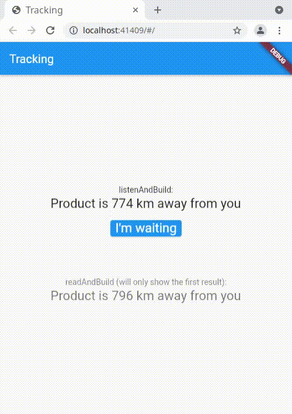

# Askless - Flutter client

:checkered_flag: [Português (Portuguese)](README_PORTUGUES.md)

Flutter client of Askless framework, which facilitates building realtime servers for JavaScript and Flutter Apps,
Askless allows to:

- :handshake: perform a websocket connection to exchange data that: 
 
    - :vibration_mode: supports streams on the client side in Flutter

    - :computer: supports JavaScript clients: Web and Node.js

    - :arrow_right_hook: it retries to send data automatically in case of connectivity issues between the client and the server

- :pencil2: create your own CRUD operations with the database you like (**C**reate, **R**ead, **U**pdate and **D**elete)

- :no_entry: restrict client access to CRUD operations

- :mega: notify in real-time clients who are listening for changes in a route, you can choose:

    - :no_pedestrians: only specify clients will receive the data
        
    - :heavy_check_mark: all clients will receive the data
    
- :lock: accept and deny connection attempts

This is the client side in Flutter, 
[click here](https://github.com/WiseTap/askless)
 to access the server side in Node.js.

## Important links
*  [Documentation](documentation/english_documentation.md)
*  [chat (example)](example/chat): Chat between the colors blue and green.
*  [catalog (example)](example/catalog): Users adding and removing products from a catalog.
*  [Getting Started (server)](https://github.com/WiseTap/askless)

## Getting Started

The "Getting Started" is a example of the Flutter client,
an example is executed locally.
 
1 - First create the server, [click here](https://github.com/WiseTap/askless) and
follow the server instructions in the section "Getting Started"

2 - To use an encrypted connection on a **test environment** such as this example
(`ws://` connection instead of `wss://`) [follow these instructions](https://flutter.dev/docs/release/breaking-changes/network-policy-ios-android).
Do not apply this on a production environment

3 - Install

pubspec.yaml:

    dependencies:
      flutter:
        sdk: flutter
        
      # Add this line:
      askless: ^1.0.1

4 - Import the package

    import 'package:askless/askless.dart';

5 - Initialize
informing the server url with port (default: 3000).
On the server side you can access the `myAsklessServer.localUrl` attribute
to discover.

6 - Perform the connection with `AsklessClient.instance.connect()`
    
Example:

    void main() {
      AsklessClient.instance.init(serverUrl:"ws://192.168.2.1:3000");
      AsklessClient.instance.connect();
      runApp(TrackingApp());
    }    

7 - Copy and paste this template into `build`

    @override
    Widget build(BuildContext context) {
      return Scaffold(
          appBar: AppBar(
            title: Text("Tracking"),
          ),
          body: Center(
            child: Column(
              mainAxisAlignment: MainAxisAlignment.center,
              children: <Widget>[
                //Show the status of the tracking in realtime
                // FIRST TODO
    
                SizedBox(height: 100,),
    
                //Send data to server with body as text: "I'm waiting"
                // SECOND TODO
               ],
            ),
          )
      );
    }

8 - Replace `FIRST TODO` by a widget that listen in realtime
a route in the server
 
    AsklessClient.instance
        .listenAndBuild(
            route: 'product/tracking',
            builder: (context,  snapshot) {
                if(!snapshot.hasData)
                    return Container();
                return Text(snapshot.data, style: _textStyle);
            }
        ),

 Replace `SECOND TODO` by a button that send data
 to a route in the server
 
    ElevatedButton(
        child: Text("I'm waiting", style: _textStyle,),
        onPressed: (){
             AsklessClient.instance
                .create(route: 'product/customerSaid', body: 'I\'m waiting')
                .then((res) => print(res.isSuccess ? 'Success' : res.error!.code));
        },
    )

Project ready! You can run :)

Following these links, you can also check this
"Getting Started" complete project of the
 [Flutter client](example/tracking) and of the
 [server in Node.js](https://github.com/WiseTap/askless/blob/master/example/tracking-ts/index.ts).

## Issues

Feel free to open a issue about:

- :grey_question: questions

- :bulb: suggestions

- :page_facing_up: documentation improvements

- :ant: potential bugs

## License

[MIT](LICENSE)
