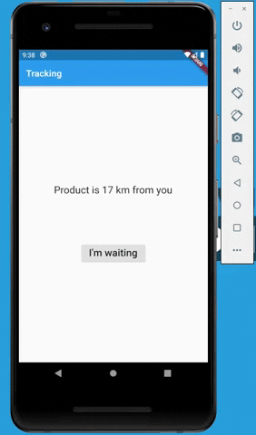

# Askless - cliente em Flutter

:checkered_flag: [English (Inglês)](README.md)

Framework que facilita criar servidores para aplicativos em Flutter e JavaScript possibilitando:

- :handshake: realizar uma conexão websocket para troca de dados que:

    - :vibration_mode: suporta integração com streams no cliente em Flutter

    - :computer: suporta clientes JavaScript: Web e Node.js

    - :arrow_right_hook: realiza o reenvio de dados em caso de instabilidade
      da conexão do cliente

    - :label: trata múltiplas e idênticas requisições de `listen` vindas do mesmo cliente como uma só pelo servidor

- :pencil2: criar as próprias operações CRUD com qualquer banco de dados que você preferir (**C**reate, **R**ead, **U**pdate e **D**elete)

- :no_entry: restringir o acesso do cliente com as operações CRUD

- :mega: notificar em tempo real clientes que estão ouvindo por mudanças de uma rota, podendo ser:

    - :no_pedestrians: apenas clientes específicos irão receber os dados

    - :heavy_check_mark: todos os clientes irão receber os dados

- :lock: aceitar e recusar tentativas de conexão

Este é lado cliente em Flutter, 
[clique aqui](https://github.com/WiseTap/askless/blob/master/README_PORTUGUES.md) para
o lado servidor em Node.js.

## Material para referência
*  [Documentação](documentation/portugues_documentacao.md)
*  [chat (exemplo)](example/chat): Troca de mensagens instantâneas entre as cores azul e verde.
*  [catalog (exemplo)](example/catalog): Simulação de múltiplos usuários alterando e removendo produtos de um catálogo.
*  [Começando (servidor)](https://github.com/WiseTap/askless/blob/master/README_PORTUGUES.md)

## Começando

A seção "Começando" é uma seção exemplo do cliente em Flutter, 
um exemplo é executado localmente.

1 - Primeiramente crie o servidor,  [clique aqui](https://github.com/WiseTap/askless/blob/master/README_PORTUGUES.md) e
siga as instruções do servidor na seção "Começando"

2 - Para utilizar uma conexão sem criptografia em um **ambiente de teste** tal como esse exemplo
(conexão `ws://` em vez de `wss://`) [siga essas instuções](https://flutter.dev/docs/release/breaking-changes/network-policy-ios-android).
Não aplique isso em um ambiente de produção

3 - Realize a instalação

pubspec.yaml:

    dependencies:
      flutter:
        sdk: flutter
        
      # Adicione essa linha:
      askless: ^2.0.0

4 - Importe

    import 'package:askless/askless.dart';

5 - Inicialize o servidor com `AsklessClient.instance.init(serverUrl:"ws://<IPV4>:<PORT>")` 
informando o endereço IPv4 da rede local obtido e a porta (padrão: 3000).

6 - Realize a conexão com o servidor com `AsklessClient.instance.connect()`
    
Exemplo:

    void main() {
      AsklessClient.instance.init(serverUrl:"ws://192.168.2.1:3000");
      AsklessClient.instance.connect();
      runApp(TrackingApp());
    }    

7 - Copie e cole esse template dentro de `build`

    @override
    Widget build(BuildContext context) {
      return Scaffold(
          appBar: AppBar(
            title: Text("Tracking"),
          ),
          body: Center(
            child: Column(
              mainAxisAlignment: MainAxisAlignment.center,
              children: <Widget>[
                //Show the status of the tracking in realtime
                // FIRST TODO
    
                SizedBox(height: 100,),
    
                //Send data to server with body as text: "I'm waiting"
                // SECOND TODO
               ],
            ),
          )
      );
    }

8 - Substitua `FIRST TODO` por um widget que realiza a leitura em tempo real
 de uma rota do servidor
 
    AsklessClient.instance
        .listenAndBuild(
            route: 'product/tracking',
            builder: (context,  snapshot) {
                if(!snapshot.hasData)
                    return Container();
                return Text(snapshot.data, style: _textStyle);
            }
        ),

 Substitua `SECOND TODO` por um botão que realiza o envio de dados para
 uma rota do servidor
 
    ElevatedButton(
        child: Text("I'm waiting", style: _textStyle,),
        onPressed: (){
             AsklessClient.instance
                .create(route: 'product/customerSaid', body: 'I\'m waiting')
                .then((res) => print(res.isSuccess ? 'Success' : res.error!.code));
        },
    )

Projeto pronto! Agora é só executar :)

Pelos links, você também pode visualizar esse projeto completo 
da seção "Começando" do [cliente em Flutter](example/tracking)
e do [servidor em Node.js](https://github.com/WiseTap/askless/blob/master/example/tracking-ts/index.ts).

## Issues

Sinta-se livre para abrir uma issue sobre:

- :grey_question: dúvidas

- :bulb: sugestões

- :page_facing_up: melhorias na documentação

- :ant: potenciais bugs

As issues devem ser escritas de preferência em inglês,
assim, todos poderão entender :grin:

## Licença

[MIT](LICENSE)
