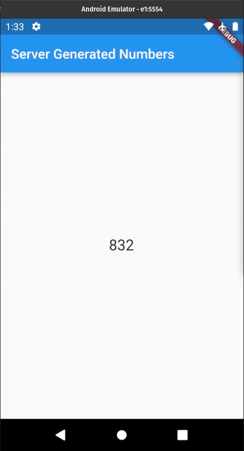

# Random Numbers App

#### An example of streaming random numbers generated by the Askless Backend (Node.js) to the Flutter App

This is the client side in Flutter,
**[click here](https://github.com/RodrigoBertotti/Askless/tree/dev/example/random-numbers-ts)** 
to access the backend side in Node.js 

 
